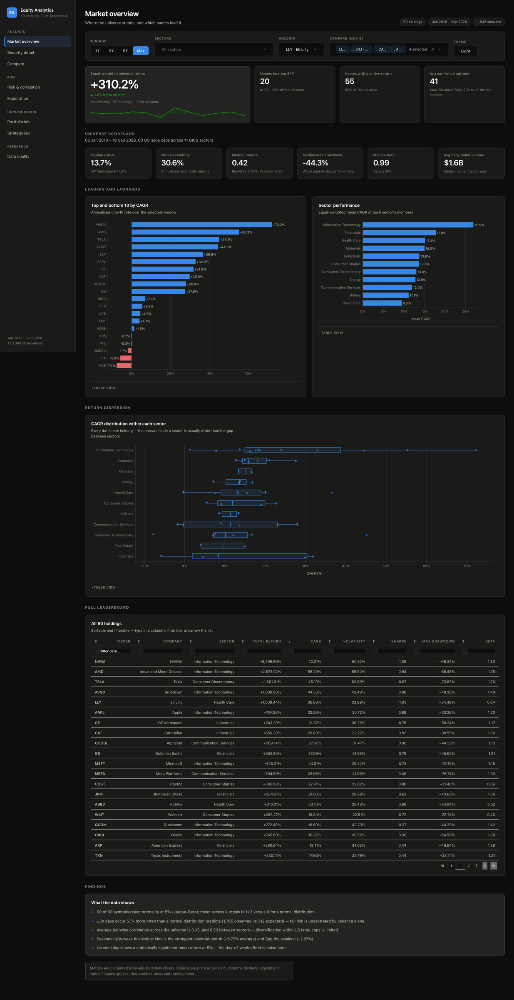
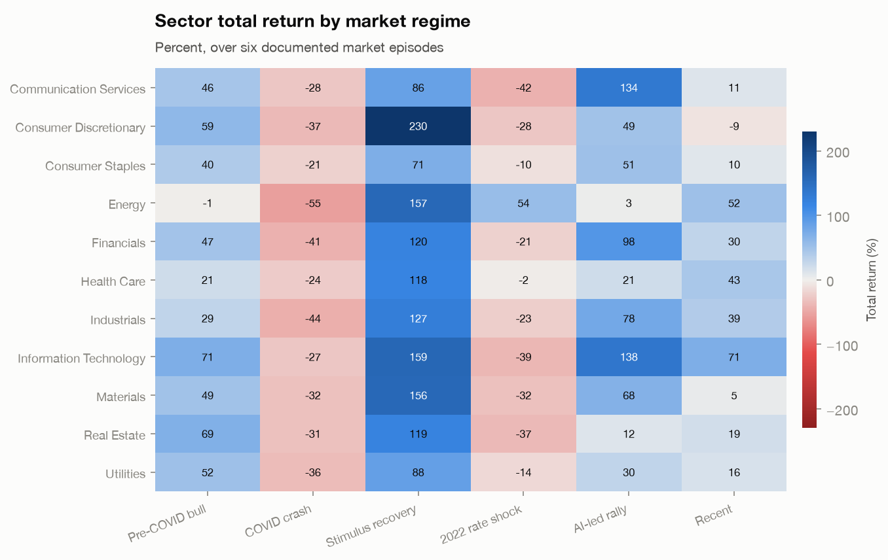
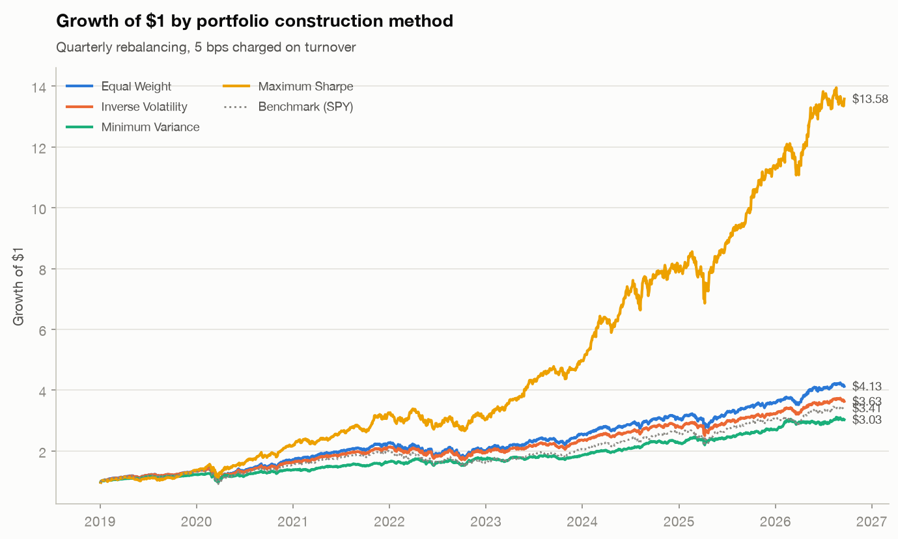
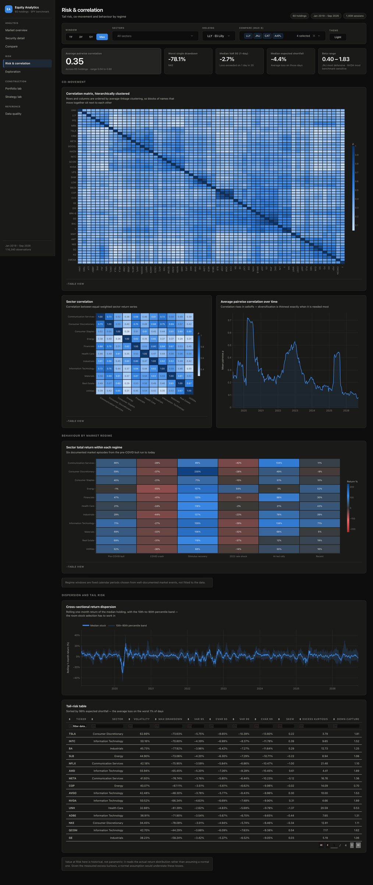
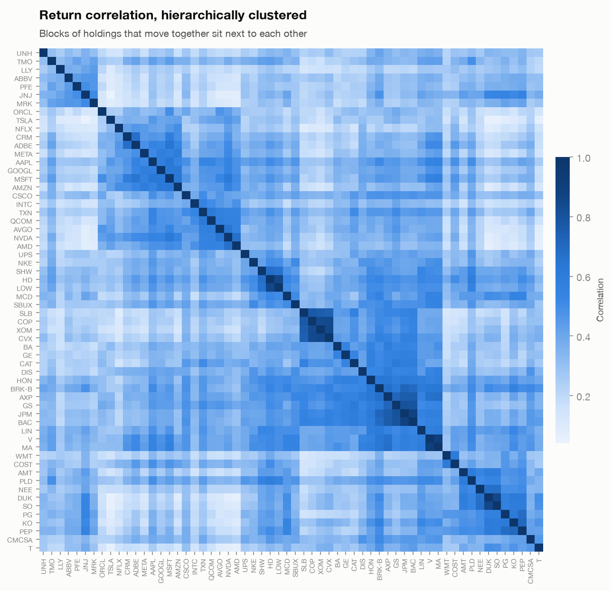

# Equity Analytics

An end-to-end analytics pipeline and interactive dashboard for a 60-stock US
large-cap universe: ingest → validate → measure → screen → construct → report.

**116,340 daily price observations · 60 holdings · 11 GICS sectors · 38 metrics per holding · 2019–2026**



---

## What it does

| Stage | Output |
|---|---|
| **Ingest** | Batched Yahoo Finance download with per-symbol retry and an on-disk cache, so reruns work offline |
| **Validate** | Shared session calendar, duplicate and bad-print removal, gap accounting, 8σ outlier flagging — all auditable |
| **Measure** | 38 risk and return metrics per holding: CAGR, Sharpe/Sortino/Calmar, CAPM beta and alpha, up/down capture, historical VaR and expected shortfall, drawdown depth and recovery |
| **Screen** | Four factors z-scored across the cross-section into a composite, plus a sector-neutral ranking |
| **Construct** | Equal-weight, inverse-volatility, minimum-variance and maximum-Sharpe portfolios, solved with SLSQP and backtested with quarterly rebalancing and transaction costs |
| **Test** | 240 rule-based backtests (4 rules × 60 holdings) with next-bar execution |
| **Report** | Text brief, 8 CSVs, an 8-sheet Excel workbook, and 8 publication-ready charts |

---

## Findings

These come out of the pipeline, not from a narrative written around it.

**1. Returns are not normally distributed, and it changes the risk numbers.**
All 60 holdings reject Jarque-Bera at 5%. Mean excess kurtosis is 11.3 against
0 for a normal distribution, and ±3σ days occur **5.7× more often** than a
normal distribution predicts (1,765 observed vs 312 expected). Value at Risk is
therefore computed historically rather than parametrically, and reported
alongside expected shortfall.

**2. Diversification is thinnest exactly when it is needed.**
Mean pairwise correlation across the universe is 0.35 — but 0.64 during the
COVID crash versus 0.26 across the rest of the sample. Portfolios are judged on
drawdown and expected shortfall rather than on average correlation.

**3. Leadership rotates completely between regimes.**
In the 2022 rate shock, Energy returned **+54%** while Information Technology
fell **−39%**. A backtest run on any single regime reaches the opposite
conclusion from one run on another.



**4. None of the classic technical rules beat buying and holding.**
Across 240 backtests, SMA 50/200 crossover, RSI mean reversion and a
trend+MACD filter all underperform buy-and-hold on mean Sharpe (0.14, 0.12 and
0.01 against 0.42) and each wins on fewer than a fifth of holdings. They do
reduce drawdown — by sitting in cash — but give up more return than the risk
they remove. Reported as-is rather than dropped.

**5. Equal weighting beats the cap-weighted benchmark with no forecast at all.**
Equal weight returns 20.2% CAGR at 18.9% volatility (Sharpe 0.93) against
SPY's 17.3% at 19.3% (Sharpe 0.75).



**6. Stock selection has more room than sector allocation.**
The CAGR spread *within* most sectors is wider than the spread *between*
sector averages. Volatility does pay over this window, but explains little:
regressing CAGR on volatility gives R² = 0.22.

---

## The dashboard

Eight pages over the same analytics state, so no two views can disagree.

| Page | What it answers |
|---|---|
| **Market overview** | Where the universe stands; leaders, laggards and sector dispersion |
| **Security detail** | One holding: price, indicators, risk profile, current signals |
| **Compare** | Up to eight holdings indexed to a common base |
| **Risk & correlation** | Clustered correlation, regime behaviour, tail risk |
| **Exploration** | Distribution shape, calendar effects, and what they rule out |
| **Portfolio lab** | Efficient frontier, weights, risk contribution |
| **Strategy lab** | Rule backtests across the universe |
| **Data quality** | Per-symbol validation audit and the full metric table |



A single filter row — time window, sectors, holding — scopes every chart on the
page. Selected holdings keep their colour when the selection changes, so a
colour never silently switches meaning.

---

## Design decisions worth calling out

- **No dual-axis charts.** Series at different scales are indexed to a common
  base instead, so the chart cannot imply a correlation that is not in the data.
- **Colour is assigned by job.** Categorical for identity (capped at 8 slots,
  never cycled), sequential for magnitude, diverging for polarity. Correlation
  matrices use a sequential ramp because the values are all positive — a
  diverging scale would waste half its range.
- **Losses are red, gains are blue, not green.** Red/green is the pairing most
  often confused under colour-vision deficiency. Both palettes are validated
  for contrast and CVD separation, in light and dark mode separately.
- **Every chart has a table view.** No value is reachable only through a tooltip.
- **Look-ahead bias is handled explicitly.** Backtest signals are generated at
  the close and traded at the next close. Where a result *is* in-sample — the
  maximum-Sharpe weights, the factor screen — it is labelled as such next to
  the number rather than in a footnote.
- **Outliers are flagged, never deleted.** Removing 8σ days would flatter every
  risk metric in the project.



---

## Running it

```bash
make setup       # create .venv and install dependencies
make run         # full pipeline → reports/ and outputs/charts/
make dashboard   # http://127.0.0.1:8050
make notebook    # exploratory analysis
```

Or without `make`:

```bash
python -m venv .venv && source .venv/bin/activate
pip install -r requirements.txt
python main.py            # pipeline; --refresh to re-download prices
python dashboard.py       # dashboard
```

First run downloads ~61 symbols (about 20 seconds) and caches them; the full
pipeline completes in roughly 15 seconds thereafter.

---

## Layout

```
src/                  analytics engine
  config.py           universe, window, parameters
  data_fetcher.py     batched ingest with retry and cache
  data_cleaner.py     calendar alignment and validation
  analyzer.py         31 indicator columns per symbol
  metrics.py          38 risk/return metrics, benchmark-relative
  screener.py         factor z-scores and composite ranking
  portfolio.py        mean-variance optimisation and backtesting
  backtest.py         rule-based strategies with next-bar execution
  eda.py              distribution, calendar, correlation, regimes
  pipeline.py         orchestration and result caching
  visualizer.py       static chart export
  report_generator.py text, CSV and Excel reports

app/                  dashboard
  theme.py            validated colour tokens, light and dark
  figures.py          Plotly figure builders
  components.py       stat tiles, cards, table views
  state.py            cached filtered views
  pages/              one module per page

notebooks/EDA.ipynb   exploratory analysis, executed
```

---

## Data and scope

Prices are split- and dividend-adjusted daily closes from Yahoo Finance. The
risk-free rate is the mean 13-week Treasury bill yield over the window (2.73%).
The benchmark is SPY. Returns exclude taxes; transaction costs are applied only
in the backtests, at 5 bps per side.

The universe is a fixed list of 60 large caps selected for sector coverage. It
is chosen with hindsight and contains only companies that still exist, so
universe-level returns carry survivorship bias — fine for studying
cross-sectional structure, not a basis for a return forecast.
